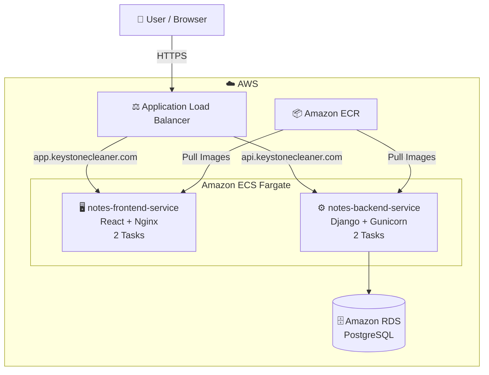
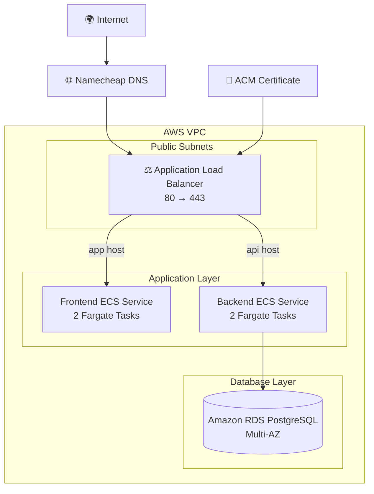
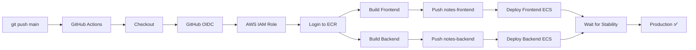
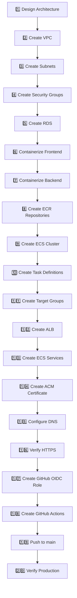

# 🚀 Scribe — 3-Tier Notes App on AWS ECS Fargate

### A production-style note-taking application split into a React frontend, Django REST API, and PostgreSQL database — containerized with Docker, deployed on AWS ECS Fargate, fronted by an HTTPS Application Load Balancer, and delivered through GitHub Actions CI/CD.


---

## 📌 What is this project?

A small notes application deliberately designed as a **real cloud deployment exercise**.

The application is split into three logical tiers:

- **Presentation tier** — React + Vite frontend served by Nginx
- **Application tier** — Django REST API running with Gunicorn
- **Data tier** — PostgreSQL on Amazon RDS

The application is packaged into containers and deployed as **independent ECS Fargate services**:

```text
┌──────────────────────────────┐
│        Presentation          │
│      React + Vite + Nginx    │
└──────────────┬───────────────┘
               │ HTTPS
               ▼
┌──────────────────────────────┐
│        Application           │
│      Django REST + Gunicorn  │
└──────────────┬───────────────┘
               │ PostgreSQL
               ▼
┌──────────────────────────────┐
│            Data              │
│       Amazon RDS PostgreSQL  │
└──────────────────────────────┘
```

---

## 🏗️ Application Architecture



### Request flow

```text
Browser
   │
   ├── https://app.keystonecleaner.com
   │          ↓
   │         ALB
   │          ↓
   │    Frontend ECS
   │
   └── https://api.keystonecleaner.com
              ↓
             ALB
              ↓
        Backend ECS
              ↓
        Amazon RDS
```

---

# ☁️ AWS Deployment Architecture



### Core AWS components

| Layer | AWS service | Purpose |
|---|---|---|
| Network | VPC | Isolated application network |
| Entry point | Application Load Balancer | Public HTTPS entry point and host-based routing |
| Containers | ECS Fargate | Runs frontend and backend containers |
| Registry | Amazon ECR | Stores Docker images |
| Database | Amazon RDS PostgreSQL | Managed application database |
| TLS | AWS Certificate Manager | HTTPS certificate |
| DNS | Namecheap | Public domain records |
| CI/CD | GitHub Actions | Build, push, and deploy automation |
| AWS auth | GitHub OIDC + IAM | Short-lived AWS credentials |

---

# 🔐 HTTPS & DNS

Two production subdomains point to the same ALB:

```text
app.keystonecleaner.com
        │
        ▼
Application Load Balancer
        │
        └── Frontend Target Group


api.keystonecleaner.com
        │
        ▼
Application Load Balancer
        │
        └── Backend Target Group
```

The ALB performs:

```text
HTTP :80
   │
   └── 301 Redirect
          ↓
HTTPS :443
```

### ACM certificate

The certificate was issued using DNS validation through Namecheap.

```text
ACM
 ↓
DNS validation CNAME
 ↓
Validation SUCCESS
 ↓
Certificate ISSUED
 ↓
Attached to ALB :443
```

---

# 🐳 Containerization

## Frontend

```text
React + Vite
      ↓
Docker multi-stage build
      ↓
Nginx
      ↓
Port 8080
```

Production API URL is injected at build time:

```text
VITE_API_URL=https://api.keystonecleaner.com
```

The frontend image is stored in:

```text
ECR → notes-frontend
```

## Backend

```text
Django REST Framework
        ↓
     Gunicorn
        ↓
      :8000
```

Health endpoint:

```text
/health/
```

The backend container can optionally execute migrations during startup:

```text
RUN_MIGRATIONS=true
```

The backend image is stored in:

```text
ECR → notes-backend
```

---

# ⚙️ ECS Fargate

The production cluster:

```text
ecs-3tier-cluster
│
├── notes-frontend-service
│   └── 2 running tasks
│
└── notes-backend-service
    └── 2 running tasks
```

### Frontend

```text
Task Definition: notes-frontend
Container: notes-frontend
Port: 8080
```

### Backend

```text
Task Definition: notes-backend
Container: notes-backend
Port: 8000
```

ECS rolling deployments replace old tasks with new revisions while maintaining the desired service capacity.

---

# 📦 Amazon ECR

Two repositories are used:

```text
notes-frontend
notes-backend
```

Each deployment creates an immutable commit-based image tag:

```text
<git-commit-sha>
```

and also updates:

```text
latest
```

Example:

```text
notes-frontend:5efe2921bd5b97f9bebf11a68564d3d0650887b5
notes-backend:<commit-sha>
```

Using the commit SHA makes the deployed image traceable back to Git.

---

# 🐙 GitHub Repository

Repository:

```text
https://github.com/Rohan-095/python-3tier-website
```

The project uses SSH authentication for Git operations:

```bash
ssh -T git@github.com
```

Expected:

```text
Hi Rohan-095! You've successfully authenticated...
```

Then normal operations can be used:

```bash
git push
git pull
git fetch
```

---

# 🔄 GitHub Actions CI/CD

The deployment pipeline is triggered whenever code is pushed to `main`.



### Pipeline steps

```text
1. Checkout source
2. Authenticate to AWS using OIDC
3. Login to ECR
4. Build frontend image
5. Inject production VITE_API_URL
6. Push frontend image
7. Build backend image
8. Push backend image
9. Read current ECS task definition
10. Render new image
11. Deploy frontend
12. Deploy backend
13. Wait for ECS service stability
14. Verify desired/running tasks
```

---

# 🔑 Why GitHub OIDC?

Permanent AWS access keys were intentionally not stored in GitHub Actions.

Instead:

```text
GitHub Actions
      ↓
OIDC Token
      ↓
AWS STS
      ↓
Temporary AWS Credentials
      ↓
IAM Role
```

Dedicated deployment role:

```text
GitHubActionsPython3TierDeploy
```

The trust policy is restricted to the project repository and `main` branch.

---

# 🔒 Application Secrets

Secrets are not committed to Git.

Ignored files include:

```text
.env
frontend/.env
backend/.env
```

Production backend configuration is supplied by ECS:

```text
DB_HOST
DB_NAME
DB_USER
DB_PASSWORD
DB_PORT
DJANGO_SECRET_KEY
ALLOWED_HOSTS
CORS_ALLOWED_ORIGINS
```

Example production CORS origin:

```text
https://app.keystonecleaner.com
```

---

# 📂 Repository Structure

```text
python-3tier-website/
│
├── backend/
│   ├── config/
│   ├── notes/
│   ├── Dockerfile
│   ├── entrypoint.sh
│   ├── manage.py
│   ├── requirements.txt
│   └── .env.example
│
├── frontend/
│   ├── src/
│   ├── Dockerfile
│   ├── nginx.conf
│   ├── package.json
│   ├── package-lock.json
│   ├── vite.config.js
│   └── .env.example
│
├── .github/
│   └── workflows/
│       └── deploy.yml
│
├── docker-compose.yml
├── .env.example
├── .gitignore
└── README.md
```

---

# 🖥️ Running Locally

Build the services:

```bash
docker compose build
```

Start them:

```bash
docker compose up
```

The exact local ports depend on the Compose configuration.

The local environment is intended for development and troubleshooting before pushing to production.

---

# 🧪 Production Verification

## Frontend

```bash
curl -I https://app.keystonecleaner.com
```

Expected:

```text
HTTP/2 200
```

## Backend health

```bash
curl -i https://api.keystonecleaner.com/health/
```

Expected:

```text
HTTP/2 200
```

## Notes API

```bash
curl https://api.keystonecleaner.com/api/notes/
```

Example response:

```json
[
  {
    "id": 2,
    "title": "Purpose"
  },
  {
    "id": 1,
    "title": "Devops"
  }
]
```

## ECS service health

```bash
aws ecs describe-services \
  --cluster ecs-3tier-cluster \
  --services notes-frontend-service notes-backend-service \
  --region us-east-1
```

Target production state:

```text
Frontend → Desired 2 / Running 2 / Pending 0
Backend  → Desired 2 / Running 2 / Pending 0
Rollout  → COMPLETED
```

---

# 🧯 Real Problems Faced

This project was built through actual troubleshooting rather than only a happy-path deployment.

## 1. ACM `PENDING_VALIDATION`

Initial state:

```text
PENDING_VALIDATION
```

The generated CNAME was added to Namecheap.

Verification:

```bash
dig +short CNAME \
_a9a617a5a65ddeff2540d62dced466d8.keystonecleaner.com
```

Final state:

```text
Domain validation → SUCCESS
Certificate        → ISSUED
```

### Lesson

Never assume DNS validation worked.

Always verify the actual public DNS record.

---

## 2. GitHub Actions IAM `AccessDeniedException`

Error:

```text
not authorized to perform:
ecs:DescribeTaskDefinition
```

Root cause:

The first IAM policy restricted an ECS action to a task-definition resource ARN even though that action requires broader resource permissions.

Fix:

```text
ecs:DescribeTaskDefinition
→ Resource: *
```

### Lesson

IAM actions do not all support the same resource-level restrictions.

---

## 3. ECS `ClientException`

The workflow initially confused:

```text
ECS Service Name
```

with:

```text
Task Definition Family
```

Examples:

```text
Service:
notes-backend-service

Task Definition:
notes-backend:3
```

The workflow was then improved to read the current task-definition ARN directly from the ECS service.

### Lesson

Always distinguish:

```text
Cluster
Service
Task Definition
Task
Target Group
Load Balancer
```

---

## 4. ECS Deployment Appeared "Stuck"

GitHub Actions showed:

```text
Deployment started
```

with:

```text
wait-for-service-stability: true
```

ECS was actually healthy.

New tasks were healthy while old targets were:

```text
draining
```

The rollout later reached:

```text
COMPLETED
```

### Lesson

"GitHub Actions is waiting" does not necessarily mean "deployment failed."

Check ECS:

```bash
aws ecs describe-services ...
```

and ALB target health:

```bash
aws elbv2 describe-target-health ...
```

---

## 5. Frontend DNS Problem

The frontend service was healthy when DNS was bypassed:

```bash
curl -Ik \
--resolve app.keystonecleaner.com:443:<ALB-IP> \
https://app.keystonecleaner.com
```

Result:

```text
HTTP/2 200
```

So the application itself was working.

The actual issue was a previous `app` subdomain delegation through Route 53 nameservers:

```text
app → AWS Route 53 NS records
```

while the desired configuration was:

```text
app → CNAME → ALB
```

The incorrect `app` NS records were removed.

Final configuration:

```text
app → ALB
api → ALB
```

### Lesson

When a subdomain fails:

```text
1. Query the authoritative nameserver
2. Query public resolvers
3. Check NS delegation
4. Check CNAME/A/AAAA conflicts
5. Then troubleshoot the application
```

---

# 🧠 Troubleshooting Playbook

When the website is not working, do not immediately rebuild containers.

Follow the request path:

```text
DNS
 ↓
TLS
 ↓
ALB
 ↓
Target Group
 ↓
ECS Task
 ↓
Application
 ↓
Database
```

### DNS

```bash
dig +short CNAME app.keystonecleaner.com @1.1.1.1
dig +short CNAME api.keystonecleaner.com @1.1.1.1
dig +short NS keystonecleaner.com
```

### ALB / target health

```bash
aws elbv2 describe-target-health \
  --target-group-arn <target-group-arn> \
  --region us-east-1
```

### ECS

```bash
aws ecs describe-services \
  --cluster ecs-3tier-cluster \
  --services notes-frontend-service notes-backend-service \
  --region us-east-1
```

### ACM

```bash
aws acm describe-certificate \
  --certificate-arn <certificate-arn> \
  --region us-east-1 \
  --query 'Certificate.{Status:Status,Validation:DomainValidationOptions[0].ValidationStatus}'
```

### HTTP

```bash
curl -I https://app.keystonecleaner.com
curl -i https://api.keystonecleaner.com/health/
```

---

# 📚 What I Learned From This Project

This project reinforced several important DevOps concepts:

### Infrastructure

- VPC is the network foundation
- subnets separate network placement
- security groups control allowed traffic
- ALB provides the public entry point
- ECS runs application containers
- RDS provides managed persistence

### Containers

- Docker packages application dependencies
- multi-stage builds keep frontend images focused
- health checks help ECS identify unhealthy tasks

### AWS

- ECR stores deployable images
- ECS task definitions describe how containers run
- ECS services maintain the desired number of tasks
- target groups connect ALB traffic to ECS tasks
- ACM provides managed TLS certificates

### CI/CD

- GitHub Actions automates delivery
- commit-SHA image tags create traceability
- OIDC removes the need for permanent AWS credentials
- ECS rolling deployments can replace tasks without manually redeploying containers

### Troubleshooting

The most important lesson:

> **Debug the layer that is actually failing.**

Do not change the application when the problem is DNS.

Do not change DNS when the target group is unhealthy.

Do not change ECS when the image was never pushed.

---

# 🔁 How to Build the Next 3-Tier Project

Use this order:



### Golden rule

**Prove the deployment manually before automating it.**

First establish:

```text
Application works
        ↓
Docker works
        ↓
ECR works
        ↓
ECS works
        ↓
ALB works
        ↓
HTTPS works
        ↓
DNS works
```

Then automate the same path with GitHub Actions.

---

# ✅ Final Production Flow

```text
Developer
    │
    │ git push
    ▼
GitHub
    │
    ▼
GitHub Actions
    │
    ├── OIDC → AWS
    │
    ├── Docker build
    │
    └── Push → ECR
              │
              ▼
        ECS Fargate
        ┌───────────────┐
        │ Frontend 2x   │
        │ Backend  2x   │
        └──────┬────────┘
               │
               ▼
        Application Load
           Balancer
               │
        ┌──────┴──────┐
        ▼             ▼
      APP             API
        │             │
        │             ▼
        │          Backend
        │             │
        └─────────────┘
                      │
                      ▼
                  RDS PostgreSQL
```

---

## 🌍 Production Endpoints

**Frontend**

https://app.keystonecleaner.com

**Backend API**

https://api.keystonecleaner.com/api/notes/

---

## 👨‍💻 Repository

**GitHub:**  
https://github.com/Rohan-095/python-3tier-website

---

> Built as a hands-on DevOps project focused on **AWS networking, Docker, ECS Fargate, ECR, RDS, ALB, HTTPS, DNS, IAM, GitHub OIDC, CI/CD, and real-world troubleshooting**.
